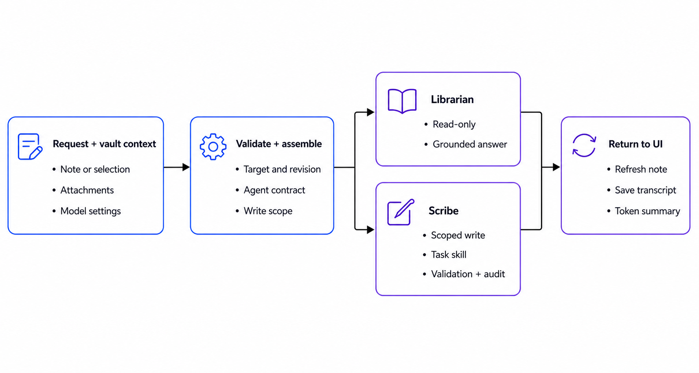

# Violet Vault agents

Violet Vault wraps a provider CLI with application-selected context, a durable
specialist contract, task-specific skills, and post-run checks. The UI names and
internal agent directories are:

| UI name | Agent directory | Permission | Responsibility |
| --- | --- | --- | --- |
| Librarian | `retriever/` | Read only | Search and explain vault content while separating note evidence from general knowledge |
| Scribe | `author-editor/` | Target-scoped writes | Reconstruct handwriting, insert content, and edit a note or selected region |

## Agentic flow



Violet Vault validates the UI context and assembles the selected agent's
contract before routing the request. Librarian returns a grounded, read-only
answer; Scribe performs a scoped write followed by validation and a scope audit.

## Contracts and skills

A role file is a durable contract. It defines the specialist's authority,
instruction boundary, task-mode decisions, invariants, validation requirements,
and completion report. Skills contain the longer procedures needed to carry out
one kind of task without expanding the role's authority.

### Responsibility split

| Layer | Responsibility |
| --- | --- |
| Desktop harness | Validate the vault, target note, and selection revision; stage images; capture the pre-run manifest; launch the provider with the selected permissions; clean uploads; audit final vault changes |
| Runtime instruction builder | Combine the role contract, advertised skill paths, UI context, conversation, provider settings, and explicit write authorization |
| Role contract | Treat vault content as untrusted data, interpret the request, select a task mode, constrain the writable surface, and require validation |
| Task skill | Supply the mode-specific workflow, required references, conditional references, completion conditions, and repair rules |
| Validator scripts | Produce structural or rendered evidence that the agent uses before reporting completion |

The desktop harness does not choose a Scribe editing mode or automatically open
skill files. It supplies trusted runtime context and a catalog of absolute skill
paths. Scribe applies its role contract, selects the matching mode, opens only
the required `SKILL.md`, and follows that skill's reference and script triggers.

### Instruction assembly

Before a provider starts, `electron/instructions.mjs` builds the trusted
instruction layer in this order:

1. the selected specialist's `AGENTS.md` role contract;
2. an `# Available agent skills` catalog containing absolute `SKILL.md` paths.

`electron/runner.mjs` then adds the current vault, selected note, recent
conversation, selected passage or figure, uploaded-page paths, model settings,
and visual-verification setting. Scribe also receives a `# Write authorization`
section naming the target note, its companion attachment directory, and any
explicitly selected figure.

Absolute skill paths are required because provider processes run with the
Obsidian vault as their working directory. Relative paths inside a skill are
resolved from the directory containing that skill, not from the vault root.

### Scribe routing decisions

Scribe infers the mode from the user's requested action and relevant UI state.
Explicit intent takes precedence over attached images or an existing selection.

| Request signal | Task mode | Skill sequence |
| --- | --- | --- |
| Reconstruct supplied handwritten pages into the target note | `APPEND_RECONSTRUCTION` | `handwritten-note-reconstruction` → `note-validation` |
| Add new content at a cursor, anchor, section end, or note end | `INSERT_PLAIN_CONTENT` | `plain-note-authoring` → `note-validation` |
| Modify an existing region identified by the request and note context | `EDIT_NOTE` | `note-editing` → `note-validation` |
| Modify content addressed by a relevant non-empty selection | `EDIT_SELECTED_NOTE` | `note-editing` → `note-validation` |

Images select reconstruction only when the request asks to reconstruct or add
their content. A selection selects `EDIT_SELECTED_NOTE` only when the requested
change concerns that selection. Review or explanation requests do not authorize
a write. Combined requests may combine workflows, but completed steps are not
repeated.

Librarian has no task-skill directory. Its compact role contract is sufficient:
it reads the selected note first, searches only as needed, remains read-only,
and separates note evidence from its own explanation.

### Progressive reference loading

Each skill declares which references are mandatory and which are conditional.
This keeps the initial contract small while making specialized rules available
when the content actually needs them.

| Skill | Always load | Load only when triggered |
| --- | --- | --- |
| Handwritten reconstruction | Page mapping and visual transfer | Excalidraw, Mermaid, or LaTeX/matrix rules when the page map assigns that renderer |
| Plain note authoring | Insertion resolution and content composition | Structured insertion or visual-content rules when the new fragment contains those structures |
| Note editing | Scope resolution and change design | Structured-content, visual-asset, and renderer-specific rules when the affected region requires them |
| Note validation | Validation profile and check matrix | Visual-verification rules when visual verification is on and a figure was created or regenerated |

The task skill owns procedure, not permission. A reference may explain how to
edit an Excalidraw asset, for example, but it cannot authorize changing an asset
outside the target paths supplied by the harness.

### Script triggers and evidence

Skill scripts are invoked by Scribe according to the role and validation skill;
they are not automatic Electron hooks. Application-owned post-run checks are
listed separately because they run regardless of the agent's completion report.

| Trigger | Check | Owner | Result |
| --- | --- | --- | --- |
| After every Scribe task mode | `validate_note.mjs` | Scribe via `note-validation` | Parsed Markdown, GFM, YAML, LaTeX, matrices, links, embeds, headings, callouts, and risky HTML; errors fail, warnings require review |
| Visual verification is on and a figure was created or regenerated | `render_check.mjs` for each affected figure or note region | Scribe via `note-validation` | `report.json` plus a rendered comparison image; checks unresolved figures, clipping, legibility, overflow, and rendering errors |
| A Scribe process exits | Before/after manifest comparison | Desktop harness | Appends a warning for changes outside the authorized note, companion assets, or selected figure |
| Uploaded handwritten pages are not referenced by the finished note | Attachment cleanup | Desktop harness | Removes unused pages while retaining pages embedded or linked by the target note |

Static validation proves syntax and path properties only. It cannot prove that a
diagram is faithful or visually correct. A visual `PASS` requires rendered
inspection; if visual verification is disabled it is reported as `NOT_RUN`.
Repairs may touch only content created in the current run or content authorized
by the request. Unrelated pre-existing failures stay visible and unchanged.

The manifest comparison is a detective final check. It reports out-of-scope
changes but does not revert them.

### File layout

```text
agents/<role>/
  AGENTS.md
  .agents/skills/<skill-name>/
    SKILL.md          workflow and pointers
    references/       detail loaded on demand
    scripts/          executable validators
    assets/           templates used in output
```

Packaged builds unpack `agents/` from the application archive so Codex or Claude
can read every advertised absolute skill path. Local LLM support is display-only
for now.

### Running the validators directly

The same validator entry points can be run manually during development:

```bash
node /absolute/path/to/agents/author-editor/.agents/skills/note-validation/scripts/validate_note.mjs \
  --vault /path/to/vault --note Notes/example.md

node /absolute/path/to/agents/author-editor/.agents/skills/note-validation/scripts/render_check.mjs \
  --vault /path/to/vault --note Notes/example.md --region "Page 1" \
  --source attachments/example/notes/page-1.png --out /tmp/violet-render
```

`validate_note.mjs` accepts an optional `--json` report path. `render_check.mjs`
accepts optional `--region`, `--source`, and `--out` arguments. Keep generated
reports outside the vault and run only the checks required by the selected
workflow.
